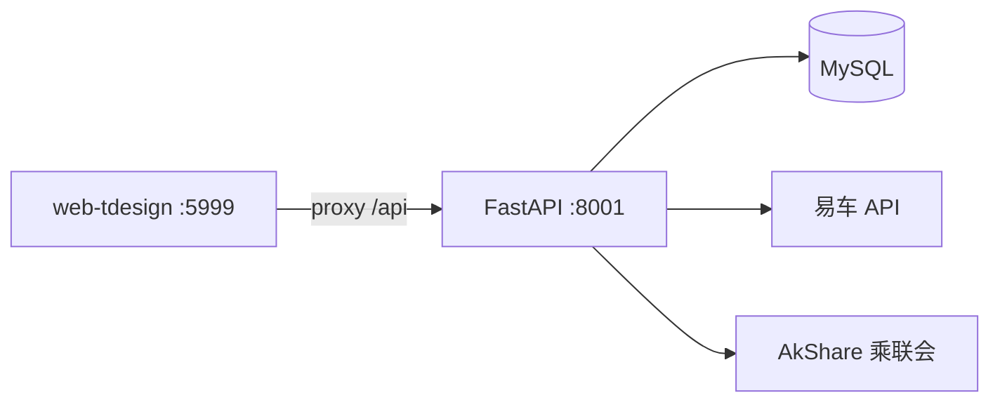

# carSales 项目参考

采集、存储、分析与可视化中国汽车市场销量数据的全栈项目。

## 仓库布局

```
carSales/                     # Git 根
├── README.md                 # 产品说明、接口、本地启动
├── backend/
│   ├── backend/              # FastAPI 应用包
│   │   ├── core/             # 数据库、CSRF、异常、日志
│   │   ├── common/           # 公共类型（types.py）、周期聚合（periods.py）
│   │   ├── models/           # SQLModel 模型
│   │   ├── routers/          # 路由（market/brand/analysis/admin）
│   │   ├── schemas/          # 请求/响应结构
│   │   ├── services/         # 业务与 import 编排
│   │   ├── sources/          # 易车、乘联会客户端
│   │   ├── meta_data.yaml    # 品牌元数据（master_id 映射）
│   │   └── origin_field_map.yaml
│   ├── init_db.sql           # MySQL 建表（唯一 schema 来源）
│   ├── requirements.txt
│   └── .env.example
├── frontend/                 # Vben Admin Monorepo
│   ├── apps/web-tdesign/     # 业务前端（唯一业务 app）
│   ├── packages/             # 工作区公共包
│   ├── internal/             # Vben 工具层（lint/vite-config/tailwind）
│   └── package.json
└── docker/                   # Compose、Dockerfile、nginx、.env.example
```

版本：前端 Monorepo **5.7.0**（`frontend/package.json`）；后端 FastAPI app **1.0.0**（`backend/backend/main.py`）。

## 技术栈

| 层 | 技术 |
|----|------|
| 后端 | Python ≥3.10，FastAPI，SQLModel/SQLAlchemy，Uvicorn/Gunicorn |
| 数据库 | **MySQL**（PyMySQL；Docker 镜像 `mysql:9.0`）；**无 Redis**（`.env.example` 中 REDIS 未使用） |
| 外部源 | 易车 HTTP API（`yiche_client.py`）；乘联会 via AkShare（`cpca_client.py`） |
| 前端 | Vue 3 + Vite，TDesign Vue Next，Vben Admin Monorepo，Pinia，ECharts |
| 包管理 | pnpm ≥10（`packageManager: pnpm@10.33.0`），Node ^20.19 \|\| ^22.18 \|\| ^24 |
| 部署 | Docker 三服务：mysql、backend、frontend（Nginx 8080） |

## 架构要点

**请求路径**：Vue SPA → `/api/*` → FastAPI routers → services → MySQL；管理刷新经 `import_service` → `sources/`。

**统一响应**：`{ code, message, data }`；成功 `code=0`。封装：`schemas/response.py` 的 `success()` / `error()`。

**CSRF**：`CSRFCookieMiddleware` 下发 `csrf_token` Cookie；非 GET 管理接口需 `X-CSRF-Token` 与 Cookie 一致（`core/csrf.py`）。前端 `api/request.ts` 自动注入。

**错误码**：`core/error_codes.py`（1001 校验、1002 权限、1003 资源不存在、2001 外部源、3001 数据库、9000 内部）；业务异常类在 `core/exceptions.py`，全局映射在 `core/exception_handlers.py`。

**数据刷新**：`import_service._batch_upsert` 用 MySQL `ON DUPLICATE KEY UPDATE`；外部源客户端内部分层返回 `HttpJsonResult` → `SliceResult`/`KeyedSliceResult`，对外统一 `SourceFetchResult`（`records`/`ok`/`errors`）；销量刷新可返回 `success` / `partial_failure` / `failed`。

**类型契约**：`common/types.py` 定义 `Literal` 维度枚举与 API/入库行 `TypedDict`（如 `NevShareTrendRow`、`OverallSalesRecord`）；分析接口按 `common/periods.py` 的 `PeriodKey` 做月度/年度聚合。



## 业务域（已实现）

| 域 | 关键文件 | 说明 |
|----|----------|------|
| 市场销量 | `market_service.py`，`views/market/` | `GET /api/v1/market/raw` 一次拉全量月度数据，前端 `marketDataUtils.ts` 本地筛选/季年聚合 |
| 品牌销量 | `brand_service.py`，`views/brand/` | 最多 4 品牌对比；依赖 `brand_meta.master_id` |
| 数据分析 | `analysis_service.py`，`schemas/analysis.py`，`views/analysis/` | 新能源渗透率、纯电占新能源比（插混=nev−bev）、国别/车系份额；后端 `years`+`granularity` 聚合，前端当前固定 `granularity=monthly` |
| 数据刷新 | `import_service.py`，`routers/admin.py` | 品牌元数据 → 总体+品牌销量 → 国别占比（顺序有依赖） |
| 品牌元数据 | `meta_data.yaml` → `brand_meta` | YAML 维护中文名、英文标识、易车 master_id |

**维度枚举**：`data_type` retail/production；`level_type` all/nev/bev；`date_type` monthly/quarterly/yearly（库表支持，采集以月度为主）；分析读 API 另用 `granularity` monthly/yearly（`AnalysisTrendQuery`）。

## 修改导航（最常改哪里）

| 目标 | 改动位置 |
|------|----------|
| 新读 API | `routers/*.py` → `services/*.py` → `schemas/*.py` → `frontend/apps/web-tdesign/src/api/` |
| 新刷新/写 API | 同上 + `import_service.py`；路由加 `Depends(verify_csrf)` |
| 新外部源 | `sources/` 新客户端；内部可用 `HttpJsonResult`/`SliceResult`，对外返回 `SourceFetchResult` |
| 分析周期/粒度 | `common/periods.py` + `common/types.py` + `schemas/analysis.py` → `analysis_service.py` → `api/analysis.ts` |
| 新表/字段 | `models/` + **`init_db.sql` 唯一索引**（upsert 依赖） |
| 新前端页 | `router/routes/modules/app.ts` + `views/` + `locales/langs/*/pages.json` |
| 市场本地聚合 | `views/market/marketDataUtils.ts`（优先复用，勿为每个筛选项打 API） |
| 图表工具 | `src/utils/chart.ts`、`src/utils/format.ts`、`src/utils/period.ts` |
| 前端 UI / 主题 | `src/styles/theme.css`（light/dark token）、`preferences.ts`；**无 PageShell**，导航标题即页名 |
| 管理刷新 UI | `layouts/basic.vue` 工具栏按钮 → SSE 进度浮层 → `api/admin.ts`；超时 300s |
| 部署/静态/API 404 | 改前端后须 **重建 frontend 镜像**；`docker/nginx.conf` 反代 `/api` → backend:8001 |

## 本地开发

| 终端 | 命令 | 端口 |
|------|------|------|
| MySQL | `mysql -u root -p < backend/init_db.sql` | 3306 |
| 后端 | `cd backend && source .venv/bin/activate && python -m backend.main` | **8001** |
| 前端 | `cd frontend && pnpm install && pnpm dev` | **5999**（代理 `/api` → 8001） |
| 前端构建 | `cd frontend && pnpm build` | 直打 Vite（~5s），见 `frontend/docs/build-performance.md` |

**环境变量**（`backend/.env`）：`DB_*`、`FASTAPI_PORT`、`LOG_LEVEL`、`LOG_DIR`。

**前端环境**（`frontend/apps/web-tdesign/.env.*`）：`VITE_GLOB_API_URL=/api`、`VITE_PORT=5999`、`VITE_ROUTER_HISTORY=hash`（hash 路由）等；默认首页 `defaultHomePath: '/market'`（`preferences.ts`）。

## 数据初始化顺序

1. `POST /api/v1/admin/data/refresh/stream`（SSE，顺序执行 brand-meta → sales → origin）

OpenAPI：`http://localhost:8001/docs`。curl 需先取 `csrf_token` Cookie 再设 `X-CSRF-Token`。

## Docker 部署要点

- 三服务：**mysql**、**backend**（Gunicorn 8001）、**frontend**（Nginx **8080** → 宿主机默认 **8081**）
- **frontend 镜像**：`turbo prune` + 分层 `pnpm install` / `pnpm build`（仅改业务代码时多数只重跑 build）；见 `docker/README.md`
- 配置以 **`docker/.env`** 为准；`VITE_*` 在 **build-arg** 打进镜像，改后须 `build frontend`
- 首次启动挂载 `init_db.sql`；**mysql_data 卷已存在时不会重跑**
- 同机部署 stockManager 时设 `COMPOSE_PROJECT_NAME=carsales`（默认已给出）
- 详见 [docker/README.md](../../../docker/README.md)

## API 一览

| 方法 | 路径 | 说明 |
|------|------|------|
| GET | `/api/v1/market/raw` | 全量月度市场原始数据 |
| GET | `/api/v1/brands/meta/all` | 全部品牌元数据 |
| GET | `/api/v1/brands/trend-all-periods` | `brand_names`（逗号，≤3）、`data_type` |
| GET | `/api/v1/analysis/nev-share/trend` | `years` 1–10（默认 3）、`granularity` monthly/yearly |
| GET | `/api/v1/analysis/nev-breakdown` | 同上；返回 bev/phev 销量与占比（phev=nev−bev） |
| GET | `/api/v1/analysis/origin-share/trend` | 同上；国别字段经 `origin_field_map.yaml` 映射为英文键 |
| POST | `/api/v1/admin/data/refresh/stream` | CSRF；`text/event-stream` |

## 前端路由

| 路径 | 页面 |
|------|------|
| `/market` | 市场销量 |
| `/brand` | 品牌销量 |
| `/nev` | NEV 覆盖率 |
| `/origin` | 车系占比 |

（旧路径 `/market-sales`、`/brand-sales`、`/data-analysis/nev`、`/data-analysis/origin` 重定向至新路径。）

## 前端 UI 约定

- **布局**：页面用 `page-content` 紧凑内边距；筛选外包 `FilterPanel`；图表/表格区块用 `SectionCard`；**不使用** Vben `Page` / PageShell（顶栏导航已有页名）
- **主题**：`preferences.ts` 默认 `slate` + `radius: 0.75`；light/dark 经偏好抽屉切换；`theme.css` 定义 `--chart-*` 与 TDesign token 桥接
- **图表**：统一走 `chart.ts`；配色运行时读 CSS 变量；禁止 `emphasis.focus: 'series'` 导致 hover 淡化其他系列
- **共享组件**：`ChartCard`、`DataLoadState`（骨架占位）、`FilterPanel`、`SectionCard`；市场/品牌周期切换在筛选条；NEV 与车系占比为同级顶层页（导航栏 Tab）

## 测试

**无自动化单元测试**。改完后手动验证：三看板加载 → 筛选/聚合 → 管理刷新（若有 UI）→ Docker 下 `/api` 反代。前端可跑 `pnpm check:type`、`pnpm lint`。

## 编码约定

- 路由薄、逻辑在 `services/`；管理写操作用 `@handle_try_catch_action`
- 新增外部源勿在 router 直接 httpx，走 `sources/` + `SourceFetchResult`；行结构优先在 `common/types.py` 用 `TypedDict` 声明
- 表结构变更同步 `models/` 与 `init_db.sql`，检查 UNIQUE 与 upsert 字段一致
- 前端 API 基址来自 `VITE_GLOB_API_URL`；生产 Docker 默认 `/api`（同源 nginx 反代）
- 业务文案 i18n：`locales/langs/zh-CN/pages.json`、`en-US/pages.json`
- **无用户登录**；仅 CSRF 保护管理 POST

## 更多细节

- 关键文件索引、数据库表、Docker 检查清单：[reference.md](reference.md)
- 部署与排障：`docker/README.md`、根目录 `README.md`
