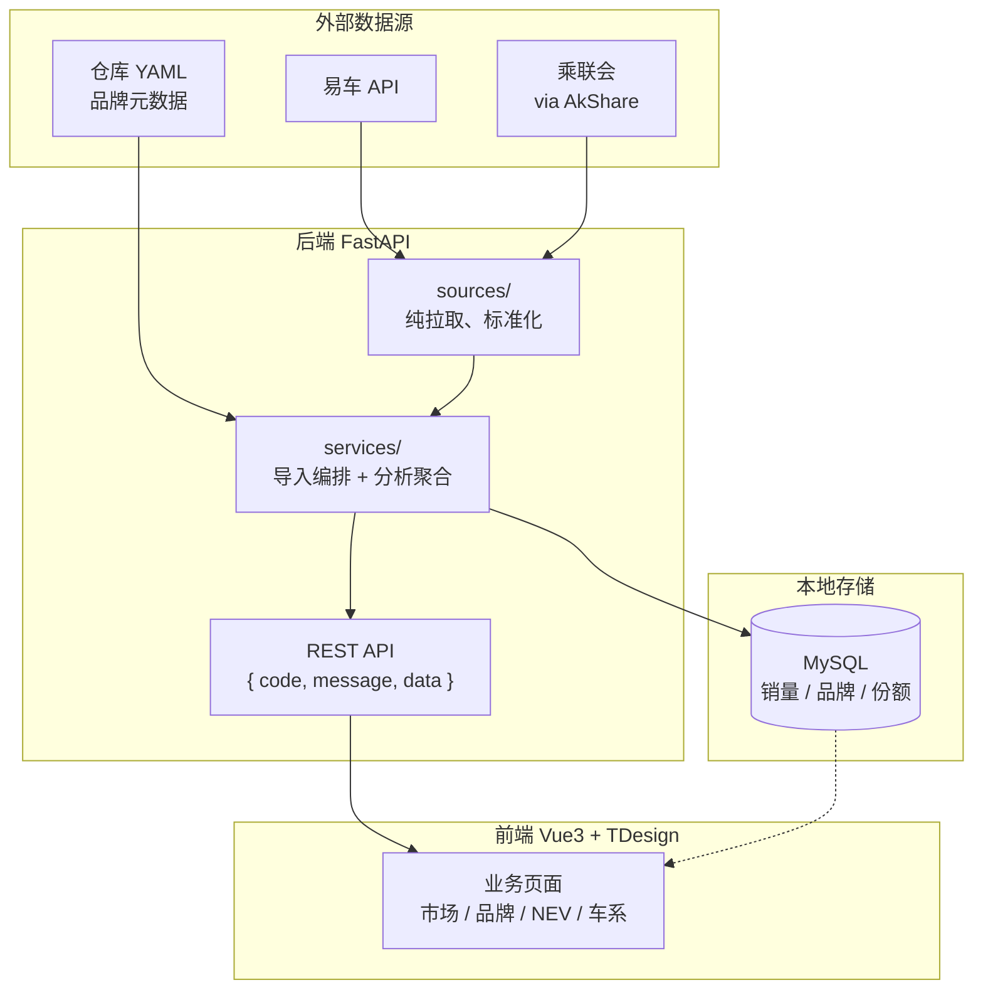

# carSales

carSales 是一个 **中国汽车市场销量** 数据采集与分析平台：从易车、乘联会等外部源拉取销量与份额数据，写入本地 MySQL，再通过 Web 页面做市场销量、品牌对比、新能源渗透率与国别/车系占比分析。

## 功能一览


| 页面      | 路径        | 做什么                                     |
| ------- | --------- | --------------------------------------- |
| 市场销量    | `/market` | 全量月度市场数据；前端本地筛选与月/季/年聚合；零售/产量，全部/新能源/纯电 |
| 品牌销量    | `/brand`  | 品牌元数据 + 最多 4 个品牌对比趋势与明细                 |
| NEV 覆盖率 | `/nev`    | 新能源渗透率、纯电占新能源比例                         |
| 车系占比    | `/origin` | 自主、德系、日系等国别/车系份额趋势                      |


数据首次为空；本地跑起来后需在页面上触发一次「刷新全部数据」（见下文）。

## 技术方案


| 层   | 技术                                                       |
| --- | -------------------------------------------------------- |
| 后端  | FastAPI + SQLModel（MySQL）+ Pandas；开发用 Uvicorn            |
| 前端  | Vue 3 + Vite + TypeScript + TDesign（Vben Admin Monorepo） |


品牌清单与易车 `master_id` 映射在 `backend/backend/meta_data.yaml`；国别字段映射在 `origin_field_map.yaml`。改品牌范围优先改 YAML。

数据流：




管理类写操作（数据刷新）启用 CSRF：浏览器会带 `csrf_token` Cookie，前端自动附加 `X-CSRF-Token`，页面内操作无需手写。

## 数据来源


| 数据                            | 来源                                     | 落库                  |
| ----------------------------- | -------------------------------------- | ------------------- |
| 总体销量（零售/产量 × 全部/新能源/纯电，月度）    | 易车销量趋势接口                               | `sales_data`        |
| 品牌销量（依赖品牌 `master_id`）        | 易车品牌销量历史接口                             | `brand_sales`       |
| 品牌元数据（中文名 / 英文标识 / master_id） | `meta_data.yaml`                       | `brand_meta`        |
| 国别/车系占比                       | 乘联会（AkShare `car_market_country_cpca`） | `origin_share_data` |


需能访问易车与乘联会/AkShare 相关外网。外部源偶发失败时，刷新可能返回 `partial_failure`，可在进度结果里查看错误摘要。

---

## 本地开发：从零跑起来

### 0. 环境要求

- Python **3.10+**
- MySQL **8.x**（或兼容版本），本机可连
- Node.js **^20.19 / ^22.18 / ^24**，包管理器用 **pnpm ≥10**（建议 `corepack enable` 后使用仓库锁定的 pnpm）
- 能访问易车、乘联会/AkShare 相关外网

本项目**不依赖 Redis**。

### 1. 克隆仓库

```bash
git clone https://github.com/gunerguner/carSalesChina.git
cd carSalesChina
```

### 2. 初始化 MySQL

```bash
mysql -u root -p < backend/init_db.sql
```

脚本会创建数据库 `car_sales` 及所需表。若你改了库名/账号，请与下一步 `.env` 保持一致。

### 3. 后端：依赖 + 配置 + 启动

```bash
cd backend
python -m venv .venv
source .venv/bin/activate   # Windows: .venv\Scripts\activate
pip install -r requirements.txt

cp .env.example .env
```

编辑 `backend/.env`，至少把数据库账号密码改成你本机可用的值：


| 变量                      | 默认                    | 说明                     |
| ----------------------- | --------------------- | ---------------------- |
| `DB_HOST`               | `localhost`           | MySQL 主机               |
| `DB_PORT`               | `3306`                | MySQL 端口               |
| `DB_USER`               | `root`                | 用户名                    |
| `DB_PASSWORD`           | （示例为 `xxx`）           | 密码，**必改**              |
| `DB_NAME`               | `car_sales`           | 库名，需与 `init_db.sql` 一致 |
| `FASTAPI_PORT`          | `8001`                | 后端端口（前端代理指向此端口）        |
| `LOG_LEVEL` / `LOG_DIR` | `INFO` / 启动目录下 `logs` | 日志                     |


> `.env.example` 里的 `REDIS_*` 当前后端未使用，可忽略。

启动后端（在已激活的 venv、且 cwd 为 `backend/`）：

```bash
python -m backend.main
```

成功后：

- API：`http://127.0.0.1:8001`
- OpenAPI（调试用）：`http://127.0.0.1:8001/docs`

### 4. 前端：依赖 + 配置 + 启动

新开一个终端：

```bash
cd frontend
corepack enable
corepack prepare pnpm@10.33.0 --activate   # 可选，与仓库 packageManager 对齐
pnpm install
```

业务应用环境变量在 `frontend/apps/web-tdesign/`。开发前确认：

```bash
# 若尚无 .env，从示例复制（含刷新确认码）
cp apps/web-tdesign/.env.example apps/web-tdesign/.env
```


| 文件                 | 说明                                                                             |
| ------------------ | ------------------------------------------------------------------------------ |
| `.env.development` | 端口 `5999`、`VITE_GLOB_API_URL=/api` 等；仓库已有，一般不用改                                |
| `.env`             | 含 `VITE_ADMIN_REFRESH_CONFIRM_CODE`（页面「刷新全部数据」确认码）；从 `.env.example` 复制后可改成自己的值 |


`/api` 由 Vite 代理到 `http://localhost:8001`。

启动：

```bash
pnpm dev
```

浏览器打开终端提示的地址（一般为 `http://127.0.0.1:5999`）。默认进入「市场销量」页。

### 5. 第一次拉数据（推荐走页面）

刚启动时各页多为空，需要先导入数据：

1. 打开前端页面，点导航栏右上角的 **刷新** 按钮（「刷新全部数据」）。
2. 输入 `frontend/apps/web-tdesign/.env` 里配置的 `VITE_ADMIN_REFRESH_CONFIRM_CODE`（示例默认为 `change-me`，若你已改过则用新值）。
3. 确认后会出现 SSE 进度浮层；服务端按顺序执行：**品牌元数据 → 总体/品牌销量 → 国别占比**。首次全量可能较久，请保持网络畅通。
4. 完成后各业务页会自动 reload；之后可按需再刷新做增量。

导入依赖外网数据源。失败时可看后端日志（默认 `backend/logs/`）或进度结果中的错误提示；确认 MySQL 与后端已启动后再重试。品牌销量为空时，优先检查是否已成功写入 `brand_meta` 且对应品牌有有效 `master_id`。

日常浏览四个菜单页即可验证功能，无需先记 API。需要调试接口时再打开 `http://127.0.0.1:8001/docs`。

### 6. 本地开发检查清单

- [ ] MySQL 已启动，并已执行 `backend/init_db.sql`
- [ ] `backend/.env` 已配置正确的 `DB_*`
- [ ] `python -m backend.main` 无报错，`:8001` 可访问
- [ ] `apps/web-tdesign/.env` 已设置 `VITE_ADMIN_REFRESH_CONFIRM_CODE`
- [ ] `pnpm dev` 已起，页面能打开（约 `:5999`）
- [ ] 已用右上角刷新拉过至少一次数据
- [ ] `/market`、`/brand`、`/nev`、`/origin` 等页面有图表或表格数据